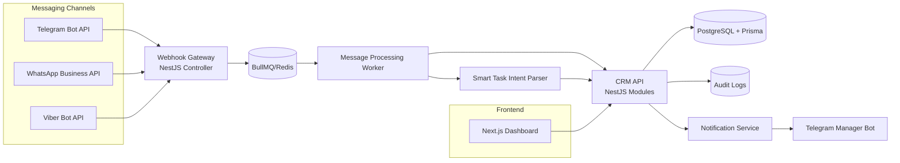

# CRM Platform (NestJS + Next.js)

## 1) System Architecture Diagram


## 2) Folder Structure
- `backend/` NestJS API, Prisma, BullMQ workers
- `frontend/` Next.js dashboard
- `infra/` docker-compose and deployment artifacts
- `docs/` architecture and operations documentation

## 3) Database Schema
See `backend/prisma/schema.prisma`.

## 4) Backend code
See `backend/src` (modules: auth, clients, tasks, messages, notifications, integrations, common).

## 5) Frontend code
See `frontend/src/app` and `frontend/src/components` for dashboard pages and reusable UI blocks.

## 6) Integration examples
See `docs/integrations.md` for Telegram/WhatsApp/Viber webhook payload handling and outbound replies.

## 7) Deployment guide
See `docs/deployment.md` and `infra/docker/docker-compose.yml`.


## Quick Start

### Docker
Run from repository root:

```bash
cp backend/.env.example backend/.env
cp frontend/.env.example frontend/.env
docker compose -f infra/docker/docker-compose.yml up -d --build
```

### Local (without Docker)

```bash
cd backend
cp .env.local.example .env
npm install
npm run prisma:generate
npm run prisma:migrate
npm run start:dev
```

In another terminal:

```bash
cd frontend
cp .env.example .env
npm install
npm run dev
```

